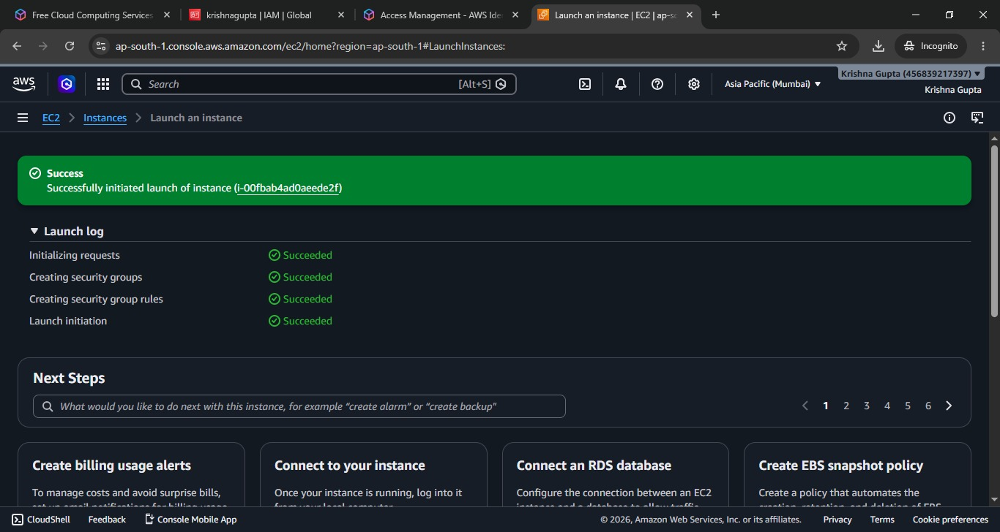
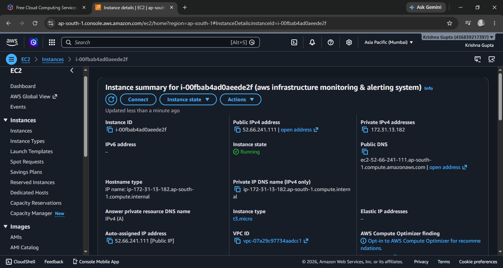
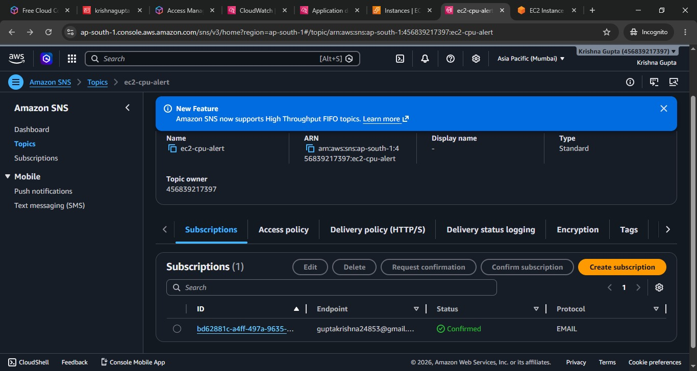
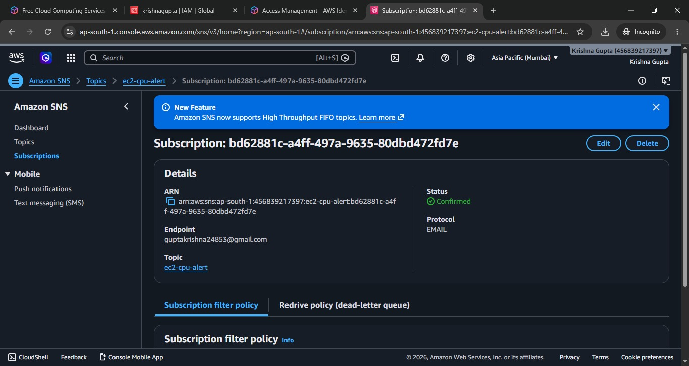
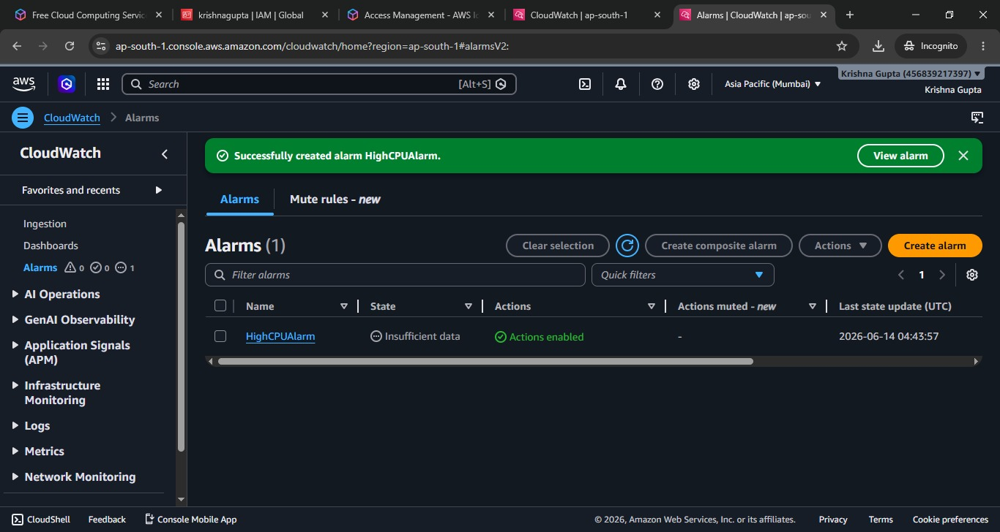
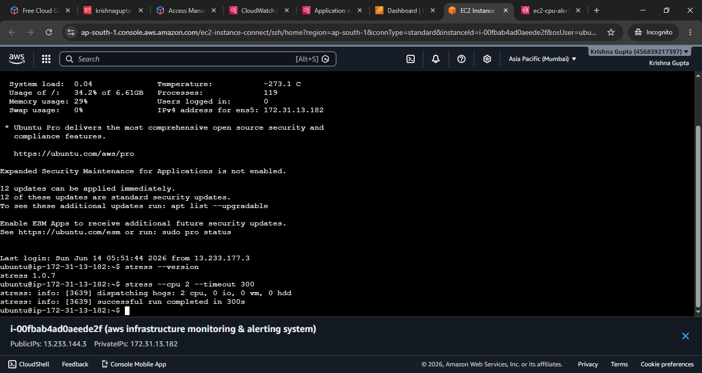
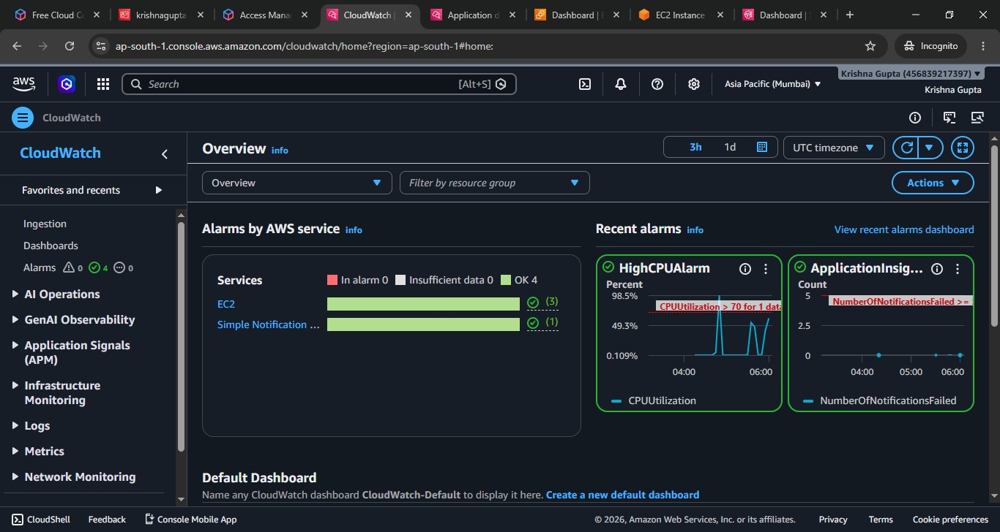
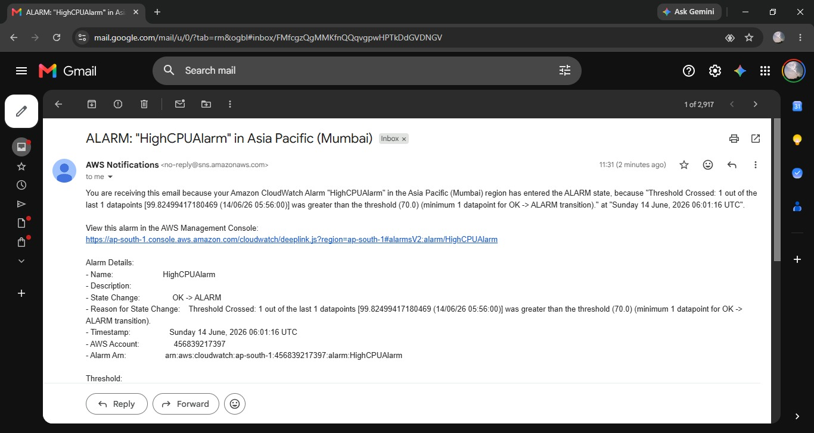

# AWS Infrastructure Monitoring & Alerting System

## Project Overview

This project demonstrates how to monitor AWS EC2 infrastructure using Amazon CloudWatch and receive real-time email alerts through Amazon SNS when CPU utilization exceeds a defined threshold.

The system helps cloud engineers proactively monitor resources and respond to performance issues before they impact applications.

---

## Architecture

EC2 Instance → CloudWatch Metrics → CloudWatch Alarm → SNS Topic → Email Notification

---

## AWS Services Used

- Amazon EC2
- Amazon CloudWatch
- Amazon SNS (Simple Notification Service)

---

## Features

- EC2 Instance Monitoring
- CPU Utilization Tracking
- CloudWatch Alarm Configuration
- SNS Email Notification Integration
- Automated Alert Generation
- Real-Time Infrastructure Monitoring

---

## Project Workflow

### Step 1: Launch EC2 Instance
Created an Ubuntu EC2 instance for monitoring.

### Step 2: Create SNS Topic
Created an SNS topic to deliver alert notifications.

### Step 3: Configure Email Subscription
Subscribed an email endpoint and confirmed the subscription.

### Step 4: Create CloudWatch Alarm
Configured a CPU utilization alarm with a threshold of 70%.

### Step 5: Generate CPU Load
Used the stress utility inside the EC2 instance to increase CPU usage.

### Step 6: Trigger Alert
CloudWatch detected high CPU utilization and changed the alarm state.

### Step 7: Receive Email Notification
SNS delivered an automated email notification.

---

## Screenshots

### 01. EC2 Instance Launch Success

### 02. EC2 Instance Details

### 03. SNS Topic Creation

### 04. SNS Email Subscription Confirmed

### 05. CloudWatch Alarm Configuration

### 06. High CPU Alarm Created

### 07. EC2 Stress Test

### 08. CloudWatch Monitoring Dashboard

### 09. High CPU Alarm Email Notification

---

## Key Learning Outcomes

- AWS Monitoring Fundamentals
- CloudWatch Metrics and Alarms
- SNS Notification Service
- Infrastructure Monitoring
- Incident Alerting
- Cloud Operations Basics

---

## Author

**Krishna Gupta**

Cloud Computing Enthusiast | AWS Learner

GitHub: https://github.com/Krishna625-coder
